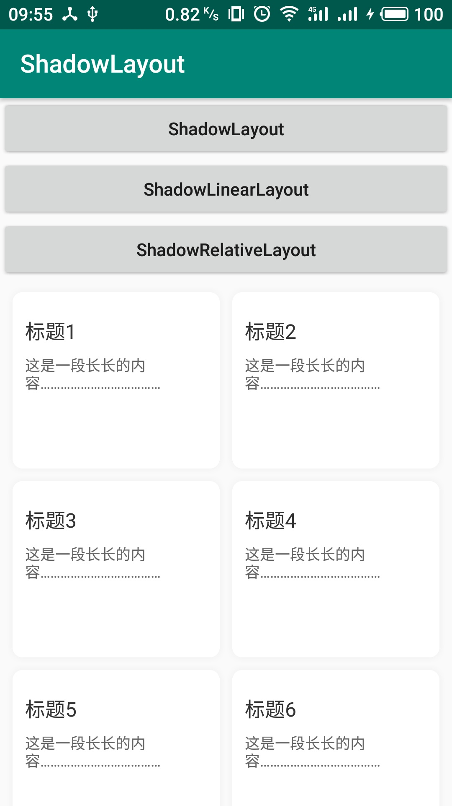
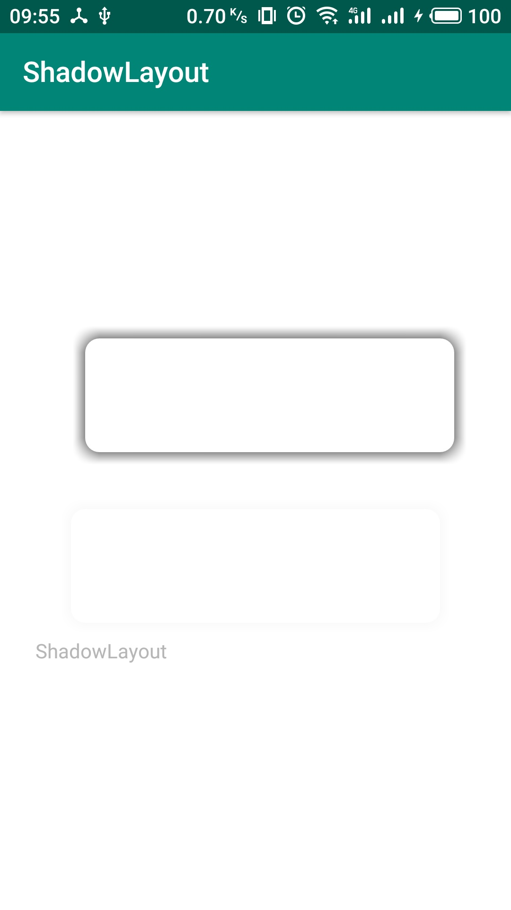
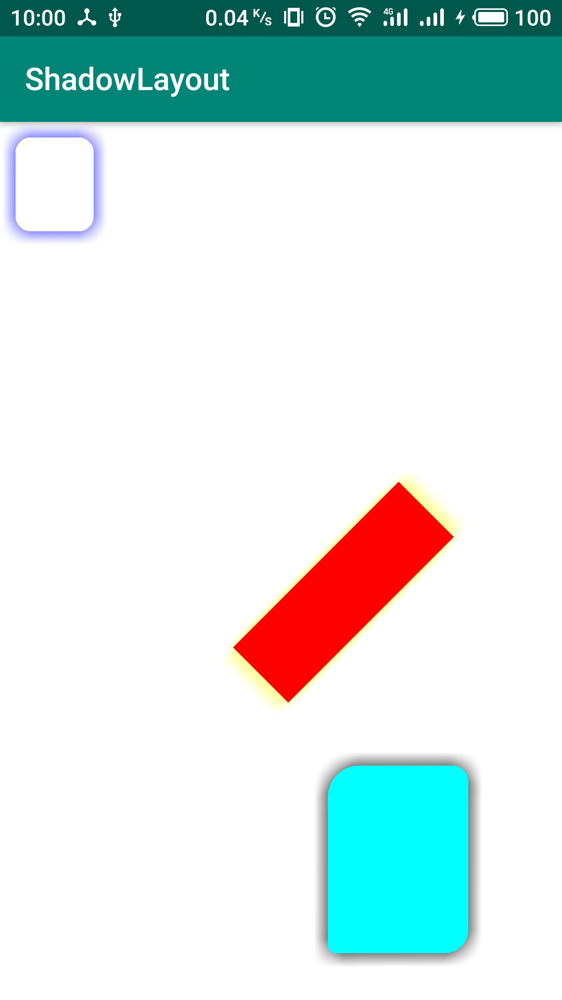

# AShadow2
Android阴影控件库
旧版：[AShadow1](https://github.com/Mosect/AShadow/tree/AShadow1)，维护中，但不添加新功能。







## 使用
```
implementation 'com.mosect.AShadow:2.0.0'
```

## XML示例
```
<?xml version="1.0" encoding="utf-8"?>
<com.mosect.ashadow.ShadowLayout xmlns:android="http://schemas.android.com/apk/res/android"
    xmlns:app="http://schemas.android.com/apk/res-auto"
    android:layout_width="match_parent"
    android:layout_height="match_parent"
    android:background="#cccccc"
    android:orientation="vertical">

    <View
        android:layout_width="100dp"
        android:layout_height="100dp"
        android:layout_gravity="center"
        app:layout_clipShadow="false"
        app:layout_roundRadius="10dp"
        app:layout_shadowColor="#000000"
        app:layout_shadowRadius="10dp"
        app:layout_solidColor="#ffffff" />
</com.mosect.ashadow.ShadowLayout>
```
视图属性：

属性名 | JAVA | XML | 取值
----- | ---- | --- | ------
阴影半径 | ShadowLayout.LayoutParams.shadowKey.shadowRadius | app:layout_shadowRadius | dimen
阴影X偏移量 | ShadowLayout.LayoutParams.shadowX | app:layout_shadowX | dimen
阴影Y偏移量 | ShadowLayout.LayoutParams.shadowY | app:layout_shadowY | dimen
阴影颜色 | ShadowLayout.LayoutParams.shadowKey.shadowColor | app:layout_shadowColor | color
圆角半径 | ShadowLayout.LayoutParams.shadowKey.radii | app:layout_roundRadius | dimen
左上角圆角半径 | ShadowLayout.LayoutParams.shadowKey.radii | app:layout_roundLT | dimen
右上角圆角半径 | ShadowLayout.LayoutParams.shadowKey.radii | app:layout_roundRT | dimen
右下角圆角半径 | ShadowLayout.LayoutParams.shadowKey.radii | app:layout_roundRB | dimen
左下角圆角半径 | ShadowLayout.LayoutParams.shadowKey.radii | app:layout_roundLB | dimen
填充颜色 | ShadowLayout.LayoutParams.shadowKey.solidColor | app:layout_solidColor | color
阴影占用空间 | ShadowLayout.LayoutParams.spaceShadow | app:layout_spaceShadow | boolean
去除填充色 | ShadowLayout.LayoutParams.noSolid | app:layout_noSolid | boolean

## 说明：
放到ShadowLayout中的视图都可以设置阴影，默认阴影半径和偏移量会影响其位置。可以通过设置spaceShadow（**ShadowLinearLayout和ShadowRelativeLayout不支持**）控制阴影是否影响视图位置。

## 自定义实现阴影或使用
* 可以通过ShadowManager.bind方法获取一个阴影
* 如果有额外实现的阴影，需要在ShadowManager中添加ShadowFactory（阴影工厂）
* 不在使用Shadow对象时需要去释放阴影对象
* 释放阴影最好调用ShadowManager.unbind方法，自己调用Shadow.unbind方法，shadow对象本身不会被释放

### Shadow（阴影）
Shadow，表示一种阴影，抽象类，需要去实现draw和onDestroy方法；调用Shadow.draw方法可以在画布的某个区域画出阴影效果。创建一个阴影对象需要key对象，key对象包含实现此种阴影所需的信息，通过Shadow.getKey方法可以获取阴影对象的key。
```
/**
 * 表示一种阴影
 */
public abstract class Shadow {

    private int usedCount;
    protected Object key;

    /**
     * 如果有地方引用此对象，需要调用此方法
     */
    public void bind() {
        synchronized (this) {
            usedCount++;
        }
    }

    /**
     * 如果不需要引用此对象，调用此方法
     */
    public void unbind() {
        synchronized (this) {
            if (usedCount > 0) {
                usedCount--;
            }
            if (usedCount == 0) {
                onDestroy();
            }
        }
    }

    /**
     * 判断此阴影对象是否被引用
     *
     * @return true，被引用
     */
    public boolean isUsed() {
        return usedCount > 0;
    }

    /**
     * 获取阴影key
     *
     * @return 阴影key
     */
    public Object getKey() {
        return key;
    }

    /**
     * 释放阴影对象
     */
    protected abstract void onDestroy();

    /**
     * 将阴影对象画在画布上
     *
     * @param canvas 画布
     * @param rect   位置和大小
     * @param paint  额外画笔
     */
    public abstract void draw(@NonNull Canvas canvas, @NonNull Rect rect, @Nullable Paint paint);
}
```

### ShadowManager（阴影管理器）
管理阴影的创建和释放，提供了默认的阴影管理器：ShadowManager.getDefault()。创建阴影需要阴影工厂（ShadowFactory），可以使用addFactory和removeFactory方法进行增加和移除阴影工厂。
```

/**
 * 阴影管理器
 */
public class ShadowManager {

    /**
     * 获取一个默认的阴影管理器
     *
     * @return 阴影管理器
     */
    public static ShadowManager getDefault() {
    }

    /**
     * 绑定一个阴影（阴影）
     *
     * @param key 阴影key
     * @return 阴影对象
     * @throws UnsupportedKeyException 不支持的阴影key
     */
    public Shadow bind(@NonNull Object key) throws UnsupportedKeyException {
    }

    /**
     * 解绑一个阴影
     *
     * @param shadow 阴影对象
     * @return true，解绑成功
     */
    public boolean unbind(@NonNull Shadow shadow) {
    }

    /**
     * 添加阴影工厂
     *
     * @param factory 阴影工厂
     */
    public void addFactory(@NonNull ShadowFactory factory) {
    }

    /**
     * 移除阴影工厂
     *
     * @param factory 阴影工厂
     */
    public void removeFactory(@NonNull ShadowFactory factory) {
    }
}
```

### ShadowFactory（阴影工厂）
一种阴影对应一个工厂，工厂接口提供以下方法：
```
/**
 * 阴影工厂
 */
public interface ShadowFactory {

    /**
     * 判断是否支持此阴影key
     *
     * @param key 阴影key
     * @return true，支持此阴影key
     */
    boolean supportKey(@NonNull Object key);

    /**
     * 复制阴影key
     *
     * @param key 阴影key
     * @return key的备份
     * @throws UnsupportedKeyException 不支持的阴影key
     */
    @NonNull
    Object copyKey(@NonNull Object key) throws UnsupportedKeyException;

    /**
     * 创建阴影
     *
     * @param key 阴影key
     * @return 阴影
     * @throws UnsupportedKeyException 不支持的阴影key
     */
    @NonNull
    Shadow create(@NonNull Object key) throws UnsupportedKeyException;
}
```

### RoundShadow（圆角矩形阴影）
对Shadow的实现，可以绘制圆角矩形阴影效果

### RoundShadow.Key（圆角矩形阴影创建的key，即阴影信息）
```
    /**
     * 圆角矩形阴影的key，可以用来创建阴影对象和比较阴影对象是否一样
     */
    public static class Key implements Serializable, Cloneable {

        public int shadowColor;
        public float shadowRadius;
        public int solidColor;
        public float[] radii;
        public boolean noSolid;

        /**
         * 克隆此对象
         *
         * @return 此对象副本
         */
        @Override
        public Key clone() {
            try {
                return (Key) super.clone();
            } catch (CloneNotSupportedException e) {
                throw new RuntimeException(e);
            }
        }

        @Override
        public int hashCode() {
            return shadowColor + solidColor +
                    Float.floatToIntBits(shadowRadius) +
                    Arrays.hashCode(radii) +
                    (noSolid ? 1 : 0);
        }

        @Override
        public boolean equals(@Nullable Object obj) {
            if (obj == this) return true;
            if (obj instanceof Key) {
                Key other = (Key) obj;
                return shadowColor == other.shadowColor &&
                        shadowRadius == other.shadowRadius &&
                        solidColor == other.solidColor &&
                        Arrays.equals(radii, other.radii) &&
                        noSolid == other.noSolid;
            }
            return false;
        }

        /**
         * 检查阴影参数是否有效
         */
        public void check() {
            if (null != radii && radii.length != 8) {
                throw new IllegalArgumentException("radii must be null or length is 8!");
            }
            if (shadowRadius <= 0) {
                throw new IllegalArgumentException("shadowRadius must more than 0!");
            }
            int alpha = Color.alpha(solidColor);
            if (alpha != 0xFF) {
                throw new IllegalArgumentException("solidColor has alpha!");
            }
        }
    }
```

### RoundShadowFactory（圆角矩形阴影工厂）
RoundShadow的工厂类

### ShadowHelper
阴影辅助工具类，帮组视图更好的绘制阴影。
```
package com.mosect.ashadow;

/**
 * 阴影辅助器
 */
public class ShadowHelper {

    private Rect childRect = new Rect();

    /**
     * 将阴影画在画布上
     *
     * @param canvas 画布
     * @param rect   阴影位置和大小
     * @param shadow 阴影对象
     * @param matrix 阴影转换矩阵
     * @param paint  画笔
     */
    public void drawShadow(
    }

    /**
     * 绘制子视图阴影
     *
     * @param canvas  画布
     * @param child   子视图
     * @param shadow  阴影
     * @param shadowX 阴影偏移量：X
     * @param shadowY 阴影偏移量：Y
     */
    public void drawChildShadow(
    }
}
```

# 联系信息
```
QQ：905340954
邮箱：zhouliuyang1995@163.com
网站：http://www.mosect.com （建设中）
```
